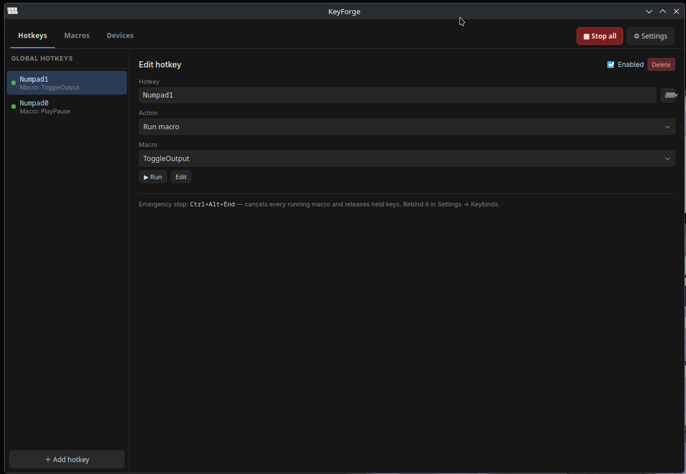
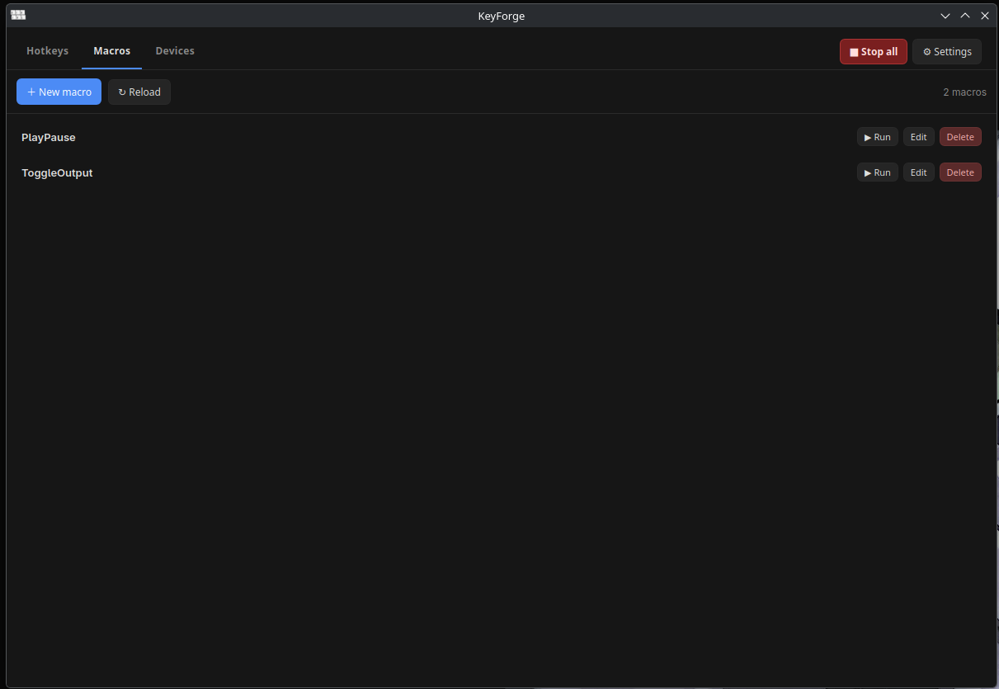
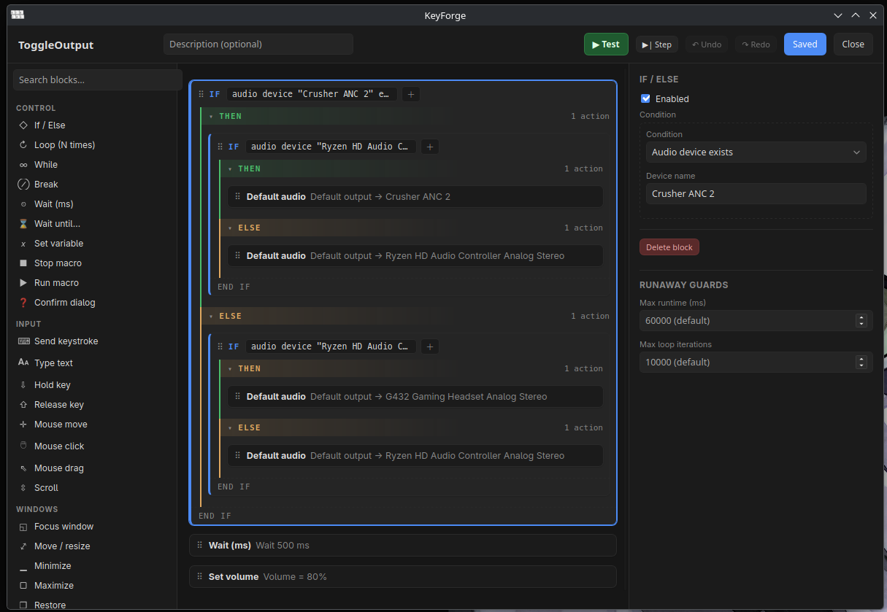

# KeyForge

**Global hotkeys + macro automation in your system tray.**

KeyForge is a desktop app that binds **global hotkeys** to actions — launching programs, running shell commands, or firing **macros** — and builds those macros in a **visual, Scratch-style block editor** (or plain JSON). Macros can move the mouse, type text, manage windows, switch audio devices, run shell commands, check pixel colours, and branch on 18 kinds of conditions, all while a dedicated **emergency stop** keeps you in control.

Everything — settings, hotkey profile, macro library, logs — lives in a **portable folder next to the executable**, so the whole app travels as one directory.


*The Global Hotkeys tab: bind a combo (Numpad1 here) to any action — launch a program, run a command, or fire a macro.*


*The Macros tab: your macro library, runnable with one click or bound to a global hotkey.*


*The visual macro editor: nested If/Else blocks, a searchable step palette, an inspector for the selected block, and per-macro runaway guards.*

---

## Features

### Global Hotkeys
- Bind any combo to three action types: **launch a program**, **run a shell command**, or **run a macro** by id or unique name.
- Combos are registered with the OS via Tauri's global-shortcut plugin and fire **in any application**, even while KeyForge is minimized or hidden in the tray.
- Duplicate combos and OS-refused registrations are **badged per row** with the reason, so a conflict never fails silently.
- Key capture is dual-mode: **record** a physical combo, or **pick** from a key catalog that reaches keys most keyboards can't physically produce (media keys, F13–F24, numpad).

### Visual Macro Editor
- 39 step types in 5 categories (Control / Input / Windows / Devices / System) with a searchable palette, drag-and-drop nesting, undo/redo (100 levels), copy/cut/paste, and save-time validation warnings.
- Container blocks (If / Loop / While / Wait-until) render their **condition as readable text** in the header — `If audio device "Ryzen HD Audio Controller…" and window title matches /…/` — with clickable chips to edit any leaf of a nested AND/OR/NOT condition tree.
- **Test runs**: run the unsaved draft whole or **a single step**, with a live per-step progress log (`start → ok | skipped | error`) streamed from the Rust engine over Tauri events.
- Per-macro **runaway guards** (max runtime, max loop iterations) editable in the inspector.
- Every parameter accepts either a literal or a **Rhai script expression** (`{"expr": "n + 1"}`), evaluated against the macro's variables.

### Emergency Stop & Safety
- A reserved **emergency-stop hotkey** (default `Ctrl+Alt+End`, rebindable in Settings → Keybinds) cancels every running macro and **releases all held keys/mouse buttons**.
- The stop is registered with **every modifier superset** of the combo (e.g. also `Ctrl+Alt+Shift+End`, `Ctrl+Alt+Super+End`, …), so it still fires when a macro is holding an extra modifier down — exactly when you need it.
- Every held key is tracked in a registry; any abnormal end (error, cancel, timeout) drains it. A macro that dies holding `Ctrl` will not leave your machine stuck.
- Runaway guards: 60 s max runtime and 10 000 loop iterations by default (per-macro overrides), plus a 16-deep sub-macro call stack with recursion detection.

### Macro Capabilities
| Area | Steps / conditions |
|---|---|
| **Control flow** | If/Else, Loop, While, Break, Wait, Wait-until (with timeout branch), Set variable, Stop macro, Run sub-macro, Confirm dialog (native OK/Cancel as a safety valve) |
| **Input** | Send keystroke combo, Type text (per-char delay), Hold/Release key, Mouse move (abs/rel/relative-to-window), Click/double-click, Drag, Scroll |
| **Windows** | Focus, Move/resize (pixels or `%` of monitor work area), Minimize, Maximize, Restore, Close, Toggle always-on-top, Move to monitor, Set opacity |
| **Devices** | Set default audio device (fuzzy name match), Adjust/Set master volume, Mute toggle, Per-application volume/mute |
| **System** | Launch program, Open path/URL, Run shell command (captures `shell_stdout` / `shell_stderr` / `shell_exit_code`), Set/read clipboard, Desktop notification, Play sound |
| **Conditions (18)** | All / Any / Not (nestable), raw Rhai expression, variable comparison, window exists / focused / title-regex, process running, USB device connected (VID:PID or name), audio device exists / is default, file exists, directory exists, **pixel colour at** (with per-channel tolerance), clipboard contains (text or regex), time of day (wraps overnight), day of week |

### Devices Tab
Live view (2 s poll) of audio output/input endpoints — with the current default flagged — and connected USB devices (name + VID:PID), the same inventory the macro conditions match against.

### Tray, Window & Shell
- **System tray icon**: left-click toggles the window; right-click menu offers *Show/hide*, *Stop all macros*, *Quit*.
- **Close-to-tray / minimize-to-tray** options (Settings → General); the flags are pushed to Rust so the window's close button can be intercepted.
- **Single instance**: a second launch focuses the existing window instead of fighting over shortcut registrations.
- **Command palette** (default `Ctrl+Shift+P`): fuzzy search over every window command **and every macro** — run any macro without binding a hotkey first.
- Rebindable **in-app keymap** (Settings → Keybinds) with conflict detection, dark/light theme, and whole-UI zoom.

---

## Architecture

KeyForge is a **Tauri v2** app: a React 19 + TypeScript (Vite) frontend talking to a Rust backend over typed `invoke` commands. The design rule that shapes everything: **the Rust macro engine is UI-agnostic** — it knows nothing about Tauri or React — and every OS capability sits behind a trait with a native implementation, a non-Windows fallback/stub, and a test fake.

```
┌───────────────────────────  React frontend (src/)  ───────────────────────────┐
│  HotkeyManager · MacroEditor (blocks, dnd, undo, test-run log) · DevicesTab   │
│  Palette (fuzzy) · SettingsModal (General, Keybinds) · KeyPicker (shared)     │
│  stores/settings.ts (zustand) · lib/ipc.ts (typed invoke/listen wrappers)     │
└──────────────┬───────────────────────────────────────────────▲────────────────┘
               │ invoke: hotkeys_*, macros_*, devices_*,       │ events:
               │ state_*, tray_prefs_set, app_version          │ macro-test-step / -done
┌──────────────▼────────────────────  Rust backend (src-tauri/) ────────────────┐
│  hotkeys/     global-shortcut plugin · profile sync · conflicts · e-stop      │
│  macros/      exec.rs  async step executor (tokio) · Rhai eval · guards       │
│               model.rs Step/Condition/Param serde model · MacroLibrary        │
│               input.rs enigo injection + held-key registry                    │
│               window.rs / audio.rs / usb.rs  trait + native impl + stub       │
│               sys.rs  clipboard · shell · pixels · time · sound · open        │
│  state.rs     portable atomic file IO next to the exe                         │
│  childenv.rs  strips our webview env vars from every child we spawn           │
└───────────────────────────────────────────────────────────────────────────────┘
```

### The hotkey layer (`src-tauri/src/hotkeys/`)
- `bindings.rs` — the `hotkeys/default.json` profile model: `{hotkey, enabled, action}` bindings plus the reserved `emergency_stop` combo. Self-describing serde tags (`"type": "launch_program" | "run_command" | "run_macro"`).
- `engine.rs` — replace-all registration with **normalize → first-binding-wins conflict detection → per-combo error map**, and the `emergency_supersets()` expansion of the stop combo.
- `mod.rs` — the Tauri wiring: the plugin event handler checks the emergency stop **first**, then dispatches the fired `Shortcut` to its bound action. A `Dispatcher` spawns `RunMacro` actions on a dedicated multi-thread tokio runtime.

### The macro engine (`src-tauri/src/macros/`)
- `model.rs` — `Step` (39 variants), `Condition` (18 variants), `Param<T>` (literal **or** `{"expr": …}`), and `MacroLibrary` which re-reads `macros/*.json` from disk on every trigger (files are tiny and hand-editable).
- `exec.rs` — the async executor: an `ExecState` carries the variable scope, a cancellation token, the runtime **deadline**, and the **loop budget** through the whole run. Sub-macros share all of it, so the guards cover the entire call tree. Rhai evaluates expressions/conditions against the scope. The same core runs in two modes:
  - `execute_macro` — fire-and-forget from a hotkey;
  - `execute_macro_observed` — the editor's test run, executing top-level steps one at a time and reporting each through a pluggable `StepSink` (a Tauri event emitter in the app, a collector in tests).
- `input.rs` — `enigo`-backed injection serialized under one lock, with the held-key registry and `release_all()` for the emergency stop. Combo tokens are shared with the global-shortcut parser, so **one key catalog** (`src/lib/keys.ts`) serves both sides.
- `window.rs` / `audio.rs` / `usb.rs` — `WindowManager`, `AudioDeviceManager`, `UsbEnumerator` traits. Windows gets Win32 (window enumeration, `IPolicyConfig` default-device switching, per-app audio sessions, SetupAPI USB enumeration); other platforms get honest stubs or X11/sysfs fallbacks.
- `sys.rs` — clipboard (`arboard`), shell (`cmd /C` / `sh -c` with timeout + cancellation, output captured to variables), pixel colour (GDI / X11 `x11rb`), notifications (`notify-rust`), sound, open-with-default, and the time/day conditions.

### Portable state (`src-tauri/src/state.rs`)
State is saved as `keyforge.json` **next to the exe** — not in an OS app-data dir — and every write is temp-file-then-rename so a crash mid-write can't corrupt it. Corrupt files are moved aside (`keyforge.json.corrupt-<ts>`, `*.json.bak`) and defaults load, so a hand-edit can never crash-loop the app.

```
KeyForge/                      ← the exe (or installed app)
├── keyforge.json              UI settings + in-app keymap (frontend-owned)
├── hotkeys/default.json       global hotkey profile + emergency stop (Rust-owned)
├── macros/*.json              the macro library, one file per macro
│   └── example.json           seeded on first run ("count to three")
├── logs/                      (created on demand)
└── screenshots/               (created on demand; drop target for shell-step output)
```

### Linux notes
On Linux, KeyForge pins GTK/WebKit to X11 before the webview initializes (`GDK_BACKEND=x11`, `WEBKIT_DISABLE_DMABUF_RENDERER=1`) because WebKitGTK + the tray die on a native Wayland display. Consequences, all documented in `lib.rs` / `childenv.rs`:
- **X11 or XWayland is required** — a pure-Wayland session with no XWayland cannot start the app.
- `childenv::strip_webview_env` records exactly those variables *we* set and removes them from **every child process** KeyForge launches (hotkey actions, shell steps, sound players, `xdg-open`), so your own Wayland-native apps aren't silently pushed through XWayland.
- Pixel/cursor queries are X11-only and fail with a clear error under Wayland.

---

## IPC surface

Every command the frontend can call (registered in `src-tauri/src/lib.rs`):

| Command | Purpose |
|---|---|
| `load_state` / `save_state` / `state_path` / `backup_corrupt_state` | portable `keyforge.json` |
| `write_text` / `read_text` / `append_text` / `logs_dir` / `screenshots_dir` | file helpers |
| `hotkeys_list` / `hotkeys_save` / `hotkeys_set_estop` | profile + OS registration, conflict errors |
| `macros_list` / `macros_get` / `macros_save` / `macros_delete` | macro library CRUD (delete is a soft rename to `.json.deleted`) |
| `macros_run` / `macros_stop_all` | fire by id/name; emergency stop (also reachable from the tray) |
| `macros_test_run` / `macros_test_step` / `macros_test_cancel` | editor test runs; progress via `macro-test-step` / `macro-test-done` events |
| `devices_audio` / `devices_audio_sessions` / `set_app_volume` / `devices_usb` | live device inventory (enumerated on scratch threads — COM must not run on the UI thread) |
| `tray_prefs_set` / `app_version` | tray behaviour flags; version shown in Settings |

---

## Getting started

### Prerequisites
- [Rust](https://rustup.rs) (stable)
- [Node.js](https://nodejs.org) 20+
- [Tauri v2 platform dependencies](https://tauri.app/start/prerequisites/)

### Develop
```sh
npm install
npm run tauri dev        # Vite on :1420 + the Rust app with HMR
```

### Build
```sh
npm run tauri build      # release bundles (per-OS targets) into src-tauri/target/release/bundle
```

Prebuilt Linux packages for 0.1.0 are also checked in under `linux_apps/` (`.deb`, `.rpm`).

### Test
```sh
cargo test               # 67 unit tests (engine, model, hotkeys, input parsing, …)
npx vitest run           # 62 tests (macro-editor model ops, key catalog, fuzzy, keymap, IPC)
```
The macro engine is exercised end-to-end with **fakes** for input/window/audio/USB (`RecordingSim`, `FakeWm`, …), so the suite runs headless on any platform.

---

## Project layout

```
KeyForge/
├── src/                          React 19 + TypeScript frontend
│   ├── App.tsx                   tabs, in-app key handler, macro-library owner
│   ├── components/
│   │   ├── HotkeyManager.tsx     Global Hotkeys tab
│   │   ├── MacroEditor.tsx       visual block editor + macro IPC + step catalog
│   │   ├── KeyPicker.tsx         shared record/pick key field
│   │   ├── DevicesTab.tsx        live audio/USB inventory
│   │   ├── Palette.tsx           fuzzy command palette
│   │   ├── SettingsModal.tsx     category-registry settings (General, Keybinds)
│   │   ├── KeybindsSettings.tsx  in-app keymap + emergency-stop rebind
│   │   └── macros.css            shared UI styles
│   ├── lib/
│   │   ├── ipc.ts                typed wrappers for every invoke/listen call
│   │   ├── keys.ts               the one key catalog both backends parse
│   │   ├── keymap.ts             in-app keymap model + defaults
│   │   ├── persist.ts            keyforge.json load/save (frontend-owned slice)
│   │   ├── fuzzy.ts              palette subsequence matcher
│   │   ├── uiStyles.ts · useBackdropClose.ts
│   └── stores/settings.ts        zustand store (settings, keymap, overlay flags)
├── src-tauri/                    Rust backend
│   ├── src/
│   │   ├── lib.rs                Tauri builder: plugins, tray, e-stop handler, invoke table
│   │   ├── main.rs               entrypoint (applies the Linux webview env pin first)
│   │   ├── state.rs              portable file IO next to the exe
│   │   ├── childenv.rs           child-process environment hygiene
│   │   ├── hotkeys/{mod,bindings,engine}.rs
│   │   └── macros/{mod,exec,model,input,window,audio,usb,sys,persist}.rs
│   ├── capabilities/default.json Tauri permission scope (clipboard, shortcuts, …)
│   └── tauri.conf.json
├── images/                       screenshots used in this README
├── linux_apps/                   prebuilt .deb / .rpm (0.1.0)
└── package.json / vite.config.ts / tsconfig.json
```

## Platforms

| Platform | Status |
|---|---|
| **Windows** | Primary target — full feature set (Win32 windows, `IPolicyConfig` audio switching, per-app volumes, SetupAPI USB, GDI pixels) |
| **Linux** | Supported via X11/XWayland (see [Linux notes](#linux-notes)); window management is stubbed, audio/USB use system backends, pixels via X11 |
| **macOS** | Compiles against the same trait layer; window/audio/USB native impls are Windows-only, so those steps degrade to clear errors |

## Ideas / status

- Version 0.1.0. The engine is feature-complete for the step/condition catalog above; expect polish (more device backends off-Windows, editor UX) in follow-ups.
